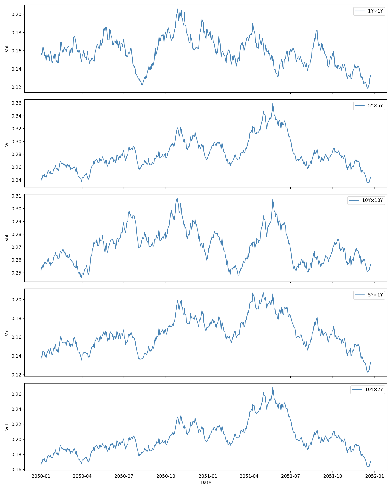
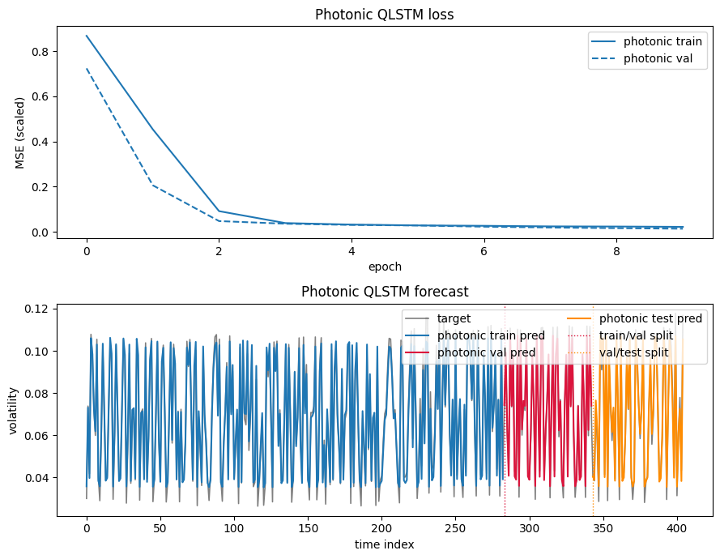
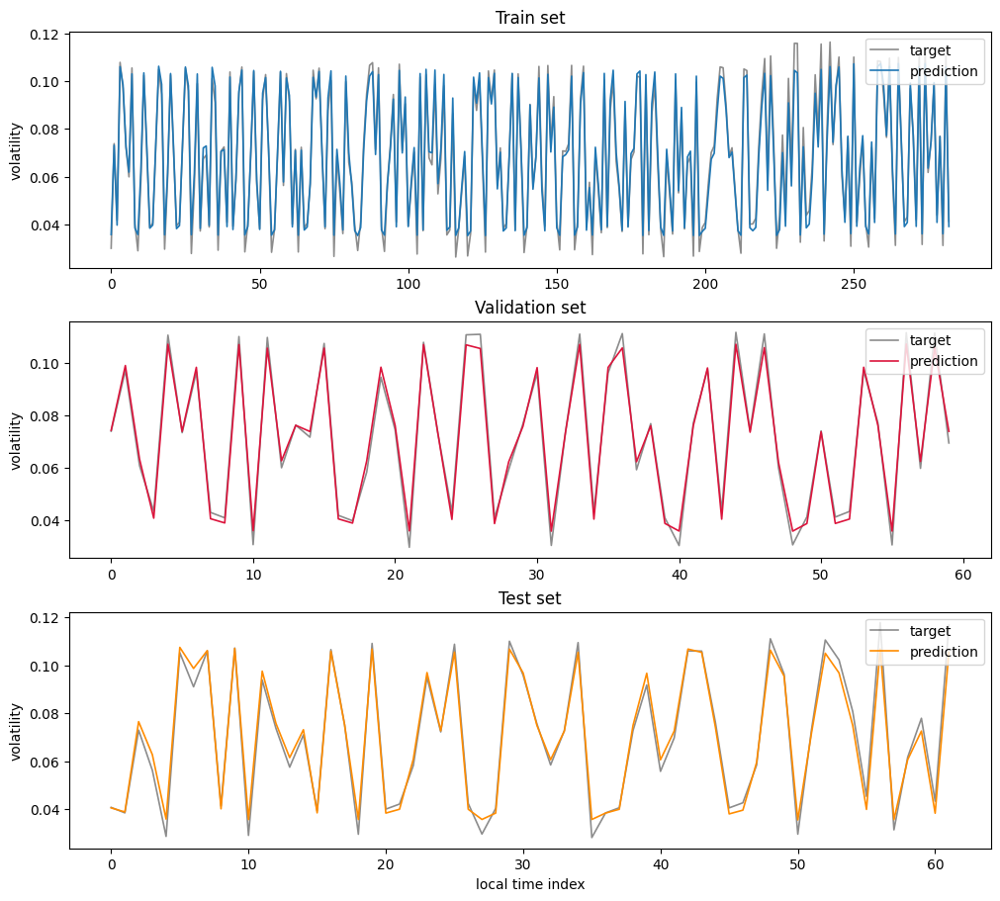

# Quantum LSTM for Local Swaption Volatility Forecasting

This repository provides a clean and reproducible implementation of a **Quantum Long Short-Term Memory (QLSTM)** model applied to swaption volatility forecasting.  
The project adopts a **local, pointwise time-series formulation** designed to remain compatible with **photonic quantum circuit constraints**, while retaining financial interpretability.

This work builds directly upon the original **QLSTM design and first MerLin photonic implementation by Jean Senellart**, which constitutes the core architectural and conceptual foundation of this repository.

---

## Context and Origin

This project originates from the **Mil’HaQ Fest 2025 hackathon (Quandela / Perceval Track)**, whose goal was to explore photonic quantum machine learning approaches for forecasting swaption volatility surfaces.

The original hackathon prototype is available at: https://github.com/fwilhelmy/milhaq-fest-2025

Due to structural modeling choices and implementation-level issues, a stable convergent QLSTM could not be obtained within the hackathon timeframe.  
This repository represents a **post-hackathon research continuation**, restructured from the ground up with the objective of producing a **minimal, correct, and reproducible photonic-compatible QLSTM baseline**.

---

## Motivation

Direct modeling of full volatility surfaces is impractical for photonic quantum circuits due to:

- circuit width scaling with feature dimension,
- mandatory dimensionality reduction (PCA, autoencoders),
- loss of local structure and interpretability.

This project reformulates volatility forecasting as a **local temporal prediction problem**, allowing:

- bounded circuit width,
- native photonic QLSTM gates,
- stable training dynamics,
- meaningful representation.

---

## Modeling Formulation

Each data point corresponds to a single (tenor, maturity) location treated as a short time series.

### Task

Given a rolling window of length $\(T\)$, predict the next local volatility value:

$\{x_{t-T+1}, \dots, x_t\} \rightarrow x_{t+1}$

### Features per time step

- tenor  
- maturity  
- time index  
- local volatility (optional)
- neighborhood mean (optional)
- neighborhood standard deviation (optional)  

The neighborhood statistics introduce controlled cross-tenor coupling without increasing quantum circuit width.

---

## Dataset Configuration (Current)

| Parameter        | Value |
|------------------|-------|
| Grid size        | 3 × 3 |
| Dates            | 50    |
| Sequence length  | 5     |
| Epochs           | 10    |
| Train/Val/Test Split  | 0.7/0.15/0.15 (Chronological) |

Normalization is fitted only on the training split to prevent temporal leakage.

---

## Experimental Results

All results are obtained using the pointwise photonic QLSTM implementation in `pointwise_swaption.ipynb`
on a reduced 3×3 swaption grid.

---

### Swaption Time Series (Raw Data)

Raw local volatility time series for representative tenor–maturity pairs.



---

### Training Curves

The model converges smoothly and reaches a stable low-error regime within a small number of epochs.





Predictions produced by the photonic QLSTM on the train, validation and test splits.
Vertical dashed lines indicate chronological split boundaries.
The model tracks both local oscillations and regime transitions without divergence.

---

## Why This Implementation Converges

Two major flaws in earlier prototypes were corrected:

1. **Quantum parameter registration**  
   Quantum gate parameters are no longer stored in conflicting `ParameterList` containers, ensuring that PyTorch optimizes the parameters actually used during forward passes.

2. **Temporal data leakage**  
   Chronological splitting and training-only normalization eliminate information leakage that previously caused constant-loss behavior.

---

## Installation
```bash
python -m venv .venv
source .venv/bin/activate
pip install -r requirements.txt
```
---

## Running Experiments
At this stage, experiments are driven **entirely through notebooks**.

| Notebook | Purpose |
|---------|--------|
| `starting_example.ipynb` | Reference QLSTM implementation by Jean Senellart |
| `pointwise_swaption.ipynb` | **Main implementation:** local QLSTM for swaption volatility |
| `surface_swaption.ipynb` | Experimental surface-level extension (work in progress) |

The `pointwise_swaption.ipynb` notebook contains the **only fully functional swaption QLSTM pipeline**.

---

## Research Scope

This repository is a **research reference implementation**, not a production forecasting system.  
It serves as a baseline for scaling studies and photonic hardware-oriented quantum recurrent modeling.

---

## Attribution and References

- Jean Senellart — First MerLin photonic QLSTM implementation and design  
  https://github.com/jsenellart/reproduced_papers/tree/c62fc11168a890e923b8314910381559afc85314/QLSTM

- Hackathon prototype (Mil’HaQ Fest 2025):  
  https://github.com/fwilhelmy/milhaq-fest-2025

- Chen, Yoo, Fang — *Quantum Long Short-Term Memory*, arXiv:2009.01783

---

## BibTeX
```bibtex
    @article{chen2020quantumlstm,
      title   = {Quantum Long Short-Term Memory},
      author  = {Chen, Samuel Yen-Chi and Yoo, Shinjae and Fang, Yao-Lung L.},
      journal = {arXiv preprint arXiv:2009.01783},
      year    = {2020},
      doi     = {10.48550/arXiv.2009.01783}
    }
```
